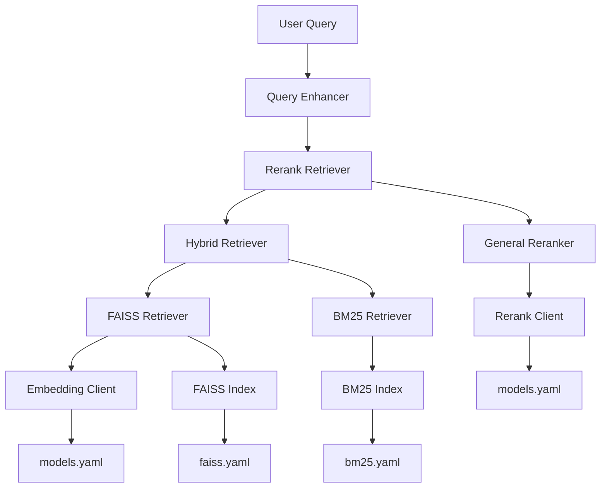

# Tiny-RAGFlow
- **重構 https://github.com/FubonDS/RRF_Embedding_Search.git**
- **embedding、reranker model engine 使用 https://github.com/FubonDS/TensorrtServer.git**

```mermaid
flowchart TD

    %% Query Entry
    Q[User Query] --> QE[Query Enhancer]

    %% Enhancer uses LLM Client

    %% Enhanced queries go into Rerank Retriever first
    QE --> RR[Rerank Retriever]

    %% Rerank Retriever delegates to Hybrid Retriever
    RR --> RH[Hybrid Retriever]

    %% Hybrid retrieves from FAISS & BM25
    RH --> R1[FAISS Retriever]
    RH --> R2[BM25 Retriever]

    %% FAISS Retriever uses embedding + FAISS Index
    R1 --> EMB[Embedding Client]
    R1 --> FIndex[FAISS Index]
    EMB --> CFG4[models.yaml]
    FIndex --> CFG1[faiss.yaml]

    %% BM25 Retriever uses BM25 Index
    R2 --> BIndex[BM25 Index]
    BIndex --> CFG2[bm25.yaml]

    %% Reranker uses Reranking Client
    RR --> RK[General Reranker]
    RK --> RC[Rerank Client]
    RC --> CFG3[models.yaml]
```