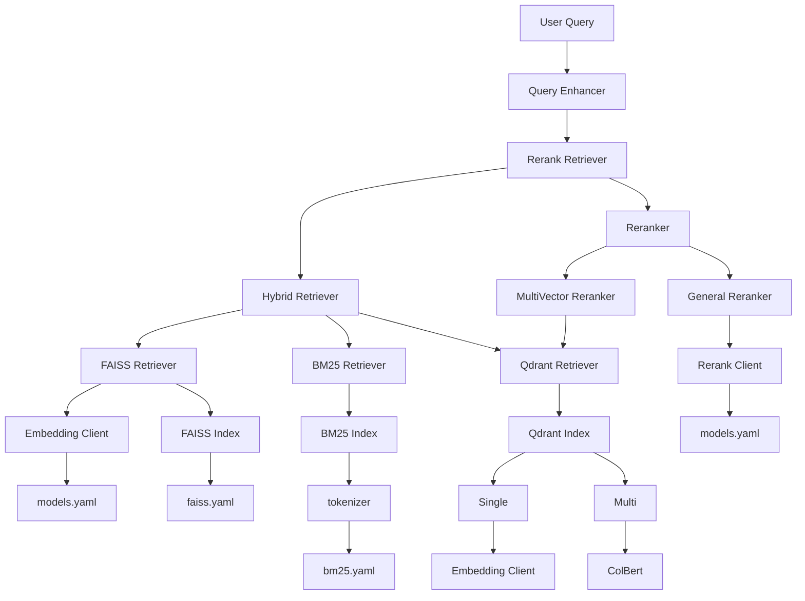

# Tiny-RAGFlow

**輕量型基於向量召回檢索系統，無須依賴資料庫，支援 faiss、bm25、qdrant 後端的單向量、多向量檢索方式，架構如下**

## 目錄

-   [架構](#架構)
-   [代碼架構](#代碼架構)
-   [資料集設定&創建 index](#資料集設定創建index)
-   [使用方法](#使用方法)

## 開發進度

<details open>
<summary><b>2025</b></summary>

```plaintext
2025-11-16 新增 faiss、bm25、hybrid retrival 方法(含創建 index、update index、search index)、reranker 召回
2025-11-20 新增 qdrant retrival 方法(單向量、多向量)
2025-11-23 新增多向量 reranker 召回
TODO : evaluation module
```

## 架構



## 代碼架構

```
rag_demo/
├── config/                      # 配置文件目錄
│   ├── faiss.yaml              # FAISS 索引配置（維度、索引類型、路徑等）
│   ├── qdrant.yaml              # qdrant 索引配置（維度、索引類型、路徑等）
│   ├── bm25.yaml               # BM25 索引配置（參數、分詞器設定）
│   ├── models.yaml             # 模型配置（LLM、Embedding 模型的 API 設定）
│   └── tokenizer/              # 分詞器配置目錄
│       ├── stopwords.txt       # 停用詞列表
│       └── user_dict.txt       # 自定義詞典
│
├── data/                        # 資料存儲目錄
│   ├── qdrant_dense_storage/            # qdrant資料index
│   ├── dataset.json            # 原始資料集（JSON 格式）
│   ├── index_test.faiss        # FAISS 向量索引文件
│   └── bm25_index.pkl          # BM25 索引文件
│
├── scripts/                     # 可執行腳本目錄
│   ├── __init__.py
│   ├── create_faiss_index.py   # 創建新的 FAISS 索引
│   ├── search_faiss.py         # 搜索 FAISS 索引
│   ├── update_faiss_index.py   # 更新現有 FAISS 索引
│   ├── create_qdrant_index.py   # 創建新的 qdrant 索引
│   ├── search_qdrant.py         # 搜索 qdrant 索引
│   ├── update_qdrant_index.py   # 更新現有 qdrant 索引
│   ├── create_qdrant_multi_index.py   # 創建新的 qdrant_multi 索引
│   ├── qdrant_multi.py         # 搜索 qdrant_multi 索引
│   ├── update_qdrant_multi_index.py   # 更新現有 qdrant_multi 索引
│   ├── create_bm25_index.py    # 創建新的 BM25 索引
│   ├── search_bm25.py          # 搜索 BM25 索引
│   └── update_bm25_index.py    # 更新現有 BM25 索引
│
├── src/                         # 核心源代碼目錄
│   ├── __init__.py
│   ├── core/                    # 核心功能模組
│   │   ├── __init__.py
│   │   ├── base_index.py       # 索引基礎抽象類別
│   │   ├── faiss_index.py      # FAISS 索引管理
│   │   ├── qdrant_index.py      # qdrant 索引管理
│   │   ├── bm25_index.py       # BM25 索引管理
│   │   ├── tokenizer.py        # 中文分詞器（基於 jieba）
│   │   └── client/
│   │       ├── embedding_rerank_client.py  # Embedding 和 Rerank 模型客戶端
│   │       └── llm_client.py               # LLM 客戶端
│   │
│   ├── retrievers/              # 檢索器模組
│   │   ├── __init__.py
│   │   ├── base_retriever.py   # 檢索器基礎抽象類別
│   │   ├── faiss_retriever.py  # FAISS 檢索器
│   │   ├── qdrant_retriever.py  # qdrant 檢索器
│   │   ├── bm25_retriever.py   # BM25 檢索器
│   │   ├── hybrid_retriever.py # 混合檢索器（支援多種融合策略）
│   │   └── rerank_retriever.py # Rerank 檢索器（在檢索後重排序）
│   │
│   ├── query_enhancers/         # 查詢增強模組
│   │   ├── __init__.py
│   │   ├── base_query_enhancer.py    # 查詢增強器基礎抽象類別
│   │   └── llm_rewrite_enhancer.py   # LLM 查詢改寫增強器
│   │
│   ├── rerankers/               # 重排序模組
│   │   ├── __init__.py
│   │   ├── base_reranker.py    # 重排序器基礎類別
│   │   └── general_reranker.py # 通用重排序（基於 Reranking 模型）
│   │   └── multivector_reranker.py # 通用重排序（基於 multivector Reranking 模型）
│   │
│   ├── pipelines/
│   │   ├── __init__.py
│   │   ├── faiss_ingestion.py
│   │   ├── qdrant_ingestion.py
│   │   ├── bm25_ingestion.py
│   │   └── query_retrieval_pipeline.py  # 查詢檢索（查詢增強+檢索+融合）
│   │
│   └── utils/
│       ├── __init__.py
│       └── utils.py
│
├── test/
├── requirements.txt
└── README.md
```

## 資料集設定&創建 index

**至少要有 id 跟 text 欄位**

```json
[
    { "id": 1, "text": "hello world" },
    { "id": 2, "text": "how are you" },
    { "id": 3, "text": "faiss is great" }
]
```

### 創建 FAISS 向量檢索

1. **配置設定**：編輯 `config/faiss.yaml` 和 `config/models.yaml`
2. **創建索引**：
    ```bash
    python scripts/create_faiss_index.py \
        --faiss_config ./config/faiss.yaml \
        --dataset_path ./data/dataset.json \
        --embedding_model m3e-base \
        --model_config_path ./config/models.yaml \
        --batch_size 8
    ```
3. **搜索查詢**：
    ```bash
    python scripts/search_faiss.py \
        --faiss-config ./config/faiss.yaml \
        --embedding_model m3e-base \
        --model_config_path ./config/models.yaml \
        --query "你的查詢文本" \
        --top-k 5
    ```
4. **更新索引**：
    ```bash
    python scripts/update_faiss_index.py \
        --faiss_config ./config/faiss.yaml \
        --dataset_path ./data/new_data.json \
        --embedding_model m3e-base \
        --model_config_path ./config/models.yaml \
        --batch_size 8
    ```

### 創建 BM25

1. **配置設定**：編輯 `config/bm25.yaml`，設定分詞器和停用詞
2. **創建索引**：
    ```bash
    python scripts/create_bm25_index.py \
        --bm25_config ./config/bm25.yaml \
        --dataset_path ./data/dataset.json \
        --batch_size 32
    ```
3. **搜索查詢**：
    ```bash
    python scripts/search_bm25.py \
        --bm25_config ./config/bm25.yaml \
        --query "你的查詢文本" \
        --top-k 5
    ```
4. **更新索引**：
    ```bash
    python scripts/update_bm25_index.py \
        --bm25_config ./config/bm25.yaml \
        --dataset_path ./data/new_data.json
    ```

### 創建 Qdrant index (single vector version)

1. **配置設定**：編輯 `config/qdrant.yaml`，設定分詞器和停用詞
2. **創建索引**：
    ```bash
    python scripts/create_qdrant_index.py \
        --qdrant_config ./config/qdrant.yaml \
        --dataset_path ./data/dataset.json \
        --embedding_model m3e-base \
        --model_config_path ./config/models.yaml \
        --batch_size 8
    ```
3. **搜索查詢**：
    ```bash
    python scripts/search_qdrant.py \
        --bm25_config ./config/qdrant.yaml \
        --embedding_model m3e-base \
        --model_config_path ./config/models.yaml \
        --query "你的查詢文本" \
        --top-k 5
    ```
4. **更新索引**：
    ```bash
    python scripts/update_qdrant_index.py \
        --qdrant_config ./config/qdrant.yaml \
        --dataset_path ./data/dataset.json \
        --embedding_model m3e-base \
        --model_config_path ./config/models.yaml \
        --batch_size 8
    ```

### 創建 Qdrant index (multi vector version)

1. **配置設定**：編輯 `config/qdrant.yaml`，設定分詞器和停用詞
2. **創建索引**：
    ```bash
    python scripts/create_qdrant_multi_index.py \
        --qdrant_config ./config/qdrant.yaml \
        --dataset_path ./data/dataset.json \
        --embedding_model_path colbert-ir/colbertv2.0 \
        --batch_size 8
    ```
3. **搜索查詢**：
    ```bash
    python scripts/search_qdrant_multi.py \
        --qdrant_config ./config/qdrant.yaml \
        --embedding_model_path colbert-ir/
        --query "你的查詢文本" \
        --top-k 5
    ```
4. **更新索引**：
    ```bash
    python scripts/update_qdrant_multi_index.py \
        --qdrant_config ./config/qdrant.yaml \
        --dataset_path ./data/dataset.json \
        --embedding_model_path colbert-ir/colbertv2.0 \
        --batch_size 8
    ```

## 使用方法

### FAISS 檢索

```python
import asyncio

from src.retrievers.faiss_retriever import FaissRetriever
async def test_retriever():
    print("==== Testing FaissRetriever ====")

    retriever = FaissRetriever.from_config({
        "index_config": "./config/faiss.yaml",
        "embedding_model": "m3e-base",
        "model_config_path": "./config/models.yaml",
        "top_k": 3
    })

    query = "hello world"
    print(f"\nQuery = {query}")

    results = await retriever.retrieve(query)

    print("\n==== Retrieve Results ====")
    for item in results:
        score = item["score"]
        meta = item["metadata"]
        print(f"{score:.4f} → id={meta.get('id')}  text={meta.get('text')}")

    queries = ["hello world", "faiss is great"]
    print(f"\nBatch Queries = {queries}")
    batch_results = await retriever.retrieve_batch(queries)
    print("\n==== Batch Retrieve Results ====")
    for i, query_results in enumerate(batch_results):
        print(f"\n-- Results for Query: {queries[i]} --")
        for item in query_results:
            score = item["score"]
            meta = item["metadata"]
            print(f"{score:.4f} → id={meta.get('id')}  text={meta.get('text')}")


if __name__ == "__main__":
    asyncio.run(test_retriever())
```

### BM25 檢索

```python
import asyncio

from src.retrievers.bm25_retriever import BM25Retriever


async def test_bm25_retriever():
    retriever = BM25Retriever.from_config({
        "index_config": "./config/bm25.yaml",
        "top_k": 3
    })

    query = "hello world"
    print(f"Query = {query}")

    results = await retriever.retrieve(query)

    print("\n===== BM25 Retrieve Results =====")
    for r in results:
        print(f"{r['score']:.4f} → id={r['metadata'].get('id')}  text={r['metadata'].get('text')}")

    # batch query test
    queries = ["hello world", "bm25 index"]
    print(f"\nBatch Queries = {queries}")
    batch_results = await retriever.retrieve_batch(queries)
    print("\n===== BM25 Batch Retrieve Results =====")
    for i, query_results in enumerate(batch_results):
        print(f"\n-- Results for Query: {queries[i]} --")
        for r in query_results:
            print(f"{r['score']:.4f} → id={r['metadata'].get('id')}  text={r['metadata'].get('text')}")


if __name__ == "__main__":
    asyncio.run(test_bm25_retriever())
```

### Qdrant 檢索

#### 單向量召回

```python
import asyncio

from src.retrievers.qdrant_retriever import QdrantRetriever


async def test_retriever():
    print("==== Testing QdrantRetriever ====")
    retriever = QdrantRetriever.from_config({
        "index_config": "./config/qdrant.yaml",
        "embedding_model": "m3e-base",
        "model_config_path": "./config/models.yaml",
        "top_k": 3
    })

    # 測試 query
    query = "hello world"
    print(f"\nQuery = {query}")

    # 執行 retrieve
    results = await retriever.retrieve(query)

    print("\n==== Retrieve Results ====")
    for item in results:
        score = item["score"]
        meta = item["metadata"]
        print(f"{score:.4f} → id={meta.get('id')}  text={meta.get('text')}")

    # 測試 batch query
    queries = ["hello world", "faiss is great"]
    print(f"\nBatch Queries = {queries}")
    batch_results = await retriever.retrieve_batch(queries)
    print("\n==== Batch Retrieve Results ====")
    for i, query_results in enumerate(batch_results):
        print(f"\n-- Results for Query: {queries[i]} --")
        for item in query_results:
            score = item["score"]
            meta = item["metadata"]
            print(f"{score:.4f} → id={meta.get('id')}  text={meta.get('text')}")


if __name__ == "__main__":
    asyncio.run(test_retriever())
```

#### MultiVector

```python
import asyncio

from src.retrievers.qdrant_retriever import QdrantRetriever, QdrantMultivectorRetriever


async def test_retriever():
    print("==== Testing QdrantRetriever ====")
    retriever = QdrantMultivectorRetriever.from_config({
        "index_config": "./config/qdrant.yaml",
        "embedding_model_path": "colbert-ir/colbertv2.0",
        "top_k": 3
    })

    # 測試 query
    query = "hello world"
    print(f"\nQuery = {query}")

    # 執行 retrieve
    results = await retriever.retrieve(query)

    print("\n==== Retrieve Results ====")
    for item in results:
        score = item["score"]
        meta = item["metadata"]
        print(f"{score:.4f} → id={meta.get('id')}  text={meta.get('text')}")

    # 測試 batch query
    queries = ["Spinal Tap, one of England's loudest bands, is chronicled by film director Marty DiBergi on what proves to be a fateful tour.", "faiss is great"]
    print(f"\nBatch Queries = {queries}")
    batch_results = await retriever.retrieve_batch(queries)
    print("\n==== Batch Retrieve Results ====")
    for i, query_results in enumerate(batch_results):
        print(f"\n-- Results for Query: {queries[i]} --")
        for item in query_results:
            score = item["score"]
            meta = item["metadata"]
            print(f"{score:.4f} → id={meta.get('id')}  text={meta.get('text')}")


if __name__ == "__main__":
    asyncio.run(test_retriever())
```

### 混合檢索

**可以任意混合上述檢索方法**

```python
import asyncio

from src.retrievers.hybrid_retriever import HybridRetriever


async def test_hybrid_retriever():
    hybrid_config = {
        "retrievers": [
            {
                "type": "faiss",
                "config": {
                    "index_config": "./config/faiss.yaml",
                    "embedding_model": "m3e-base",
                    "model_config_path": "./config/models.yaml",
                    "top_k": 3
                }
            },
            {
                "type": "bm25",
                "config": {
                    "index_config": "./config/bm25.yaml",
                    "top_k": 3
                }
            }
        ],
        "fusion_method": "rrf",
        "rrf_k": 60,
        "top_k": 3
    }

    hybrid = HybridRetriever.from_config(hybrid_config)

    results = await hybrid.retrieve("hello world", top_k=3)
    print("\n==== Hybrid Retrieve Results ====")
    for item in results:
        score = item["score"]
        meta = item["metadata"]
        print(f"{score:.4f} → id={meta.get('id')}  text={meta.get('text')}")

    # 測試 batch query
    queries = ["hello world", "faiss is great"]
    print(f"\nBatch Queries = {queries}")
    batch_results = await hybrid.retrieve_batch(queries, top_k=3)
    print("\n==== Hybrid Batch Retrieve Results ====")
    for i, query_results in enumerate(batch_results):
        print(f"\n-- Results for Query: {queries[i]} --")
        for item in query_results:
            score = item["score"]
            meta = item["metadata"]
            print(f"{score:.4f} → id={meta.get('id')}  text={meta.get('text')}")

if __name__ == "__main__":
    asyncio.run(test_hybrid_retriever())
```

### 加入 Rerank

#### Faiss + reranker(單向量召回)

```python
import asyncio

from src.retrievers.rerank_retriever import RerankRetriever


async def test():
    config = {
        "retriever": {
            "type": "faiss",
            "config": {
                "index_config": "./config/faiss.yaml",
                "embedding_model": "m3e-base",
                "model_config_path": "./config/models.yaml",
                "top_k": 3
            }
        },
        "reranker": {
            "type": "general_reranker",
            "config": {
                "model_name": "bge-reranker-base",
                "config_path": "./config/models.yaml"
            }
        },
        "top_k": 3
    }
    retriever = RerankRetriever.from_config(config)

    query = "hello world"
    results = await retriever.retrieve(query)

    for r in results:
        print(r)

    queries = ["hello world", "faiss index"]
    batch_results = await retriever.retrieve_batch(queries)
    for i, query_results in enumerate(batch_results):
        print(f"\n-- Results for Query: {queries[i]} --")
        for r in query_results:
            print(r)

if __name__ == "__main__":
    asyncio.run(test())
```

#### bm25 + reranker(單向量召回)

```python
import asyncio

from src.retrievers.rerank_retriever import RerankRetriever


async def test():
    config = {
        "retriever": {
            "type": "bm25",
            "config": {
                "index_config": "./config/bm25.yaml",
                "top_k": 3
            }
        },
        "reranker": {
            "type": "general_reranker",
            "config": {
                "model_name": "bge-reranker-base",
                "config_path": "./config/models.yaml"
            }
        },
        "top_k": 3
    }

    retriever = RerankRetriever.from_config(config)

    query = "hello world"
    results = await retriever.retrieve(query)

    for r in results:
        print(r)

    queries = ["hello world", "faiss index"]
    batch_results = await retriever.retrieve_batch(queries)
    for i, query_results in enumerate(batch_results):
        print(f"\n-- Results for Query: {queries[i]} --")
        for r in query_results:
            print(r)

if __name__ == "__main__":
    asyncio.run(test())
```

#### hybrid + reranker(單向量召回)

```python
import asyncio

from src.retrievers.rerank_retriever import RerankRetriever


async def test():
    config = {
        "retriever": {
            "type": "hybrid",
            "config": {
                    "retrievers": [
                {
                    "type": "faiss",
                    "config": {
                        "index_config": "./config/faiss.yaml",
                        "embedding_model": "m3e-base",
                        "model_config_path": "./config/models.yaml",
                        "top_k": 3
                    }
                },
                {
                    "type": "bm25",
                    "config": {
                        "index_config": "./config/bm25.yaml",
                        "top_k": 3
                }
            }
        ],
        "fusion_method": "rrf",
        "rrf_k": 60,
        "top_k": 3
            }
        },
        "reranker": {
            "type": "general_reranker",
            "config": {
                "model_name": "bge-reranker-base",
                "config_path": "./config/models.yaml"
            }
        },
        "top_k": 3
    }

    retriever = RerankRetriever.from_config(config)

    query = "hello world"
    results = await retriever.retrieve(query)

    for r in results:
        print(r)

    queries = ["hello world", "faiss index"]
    batch_results = await retriever.retrieve_batch(queries)
    for i, query_results in enumerate(batch_results):
        print(f"\n-- Results for Query: {queries[i]} --")
        for r in query_results:
            print(r)

if __name__ == "__main__":
    asyncio.run(test())
```

#### 單向量召回 改為 多向量召回

**只需要將 config 由**

```python
config = {
        "retriever": {
            "type": "faiss",
            "config": {
                "index_config": "./config/faiss.yaml",
                "embedding_model": "m3e-base",
                "model_config_path": "./config/models.yaml",
                "top_k": 3
            }
        },
        "reranker": {
            "type": "general_reranker",
            "config": {
                "model_name": "bge-reranker-base",
                "config_path": "./config/models.yaml"
            }
        },
        "top_k": 3
    }
```

**改為**

```python
config = {
        "retriever": {
            "type": "faiss",
            "config": {
                "index_config": "./config/faiss.yaml",
                "embedding_model": "m3e-base",
                "model_config_path": "./config/models.yaml",
                "top_k": 3
            }
        },
        "reranker": { # 更改這裡的配置
            "type": "multivector_reranker",
            "config": {
                "index_config": "./config/qdrant.yaml",
                "embedding_model_path": "colbert-ir/colbertv2.0",
                "top_k": 3
            }
        },
        "top_k": 3
    }
```
